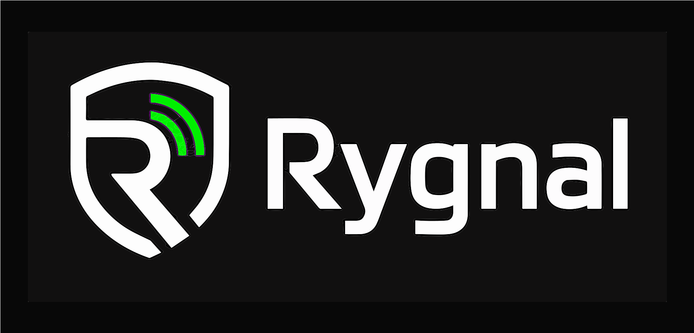

  

  <code style="font-family: 'SF Mono', Menlo, Monaco, Consolas, monospace; font-size: 1.15em; font-weight: bold; letter-spacing: -0.02em; color: #46e12a; background: transparent;">
    Runtime governance and security controls for AI-agent tool actions.
  </code>

  
  
  
  

---

## What Rygnal builds

AI agents execute tool actions — reading secrets, writing files, calling APIs, running shell commands. Most frameworks let agents do this freely.

Rygnal adds a **governance layer** between the agent and the tool, enforcing policy-driven controls at runtime before any action runs.

| Capability | What it does |
|---|---|
| **Policy-driven execution** | Define allow/deny rules for tool actions before they execute |
| **Risk scoring** | Evaluate action risk at runtime using configurable checks |
| **Audit logging** | Immutable, structured records of every runtime decision |
| **Human approval flows** | Pause and require human sign-off when action risk is high |
| **Brokered execution** | Out-of-process execution boundary to prevent in-process bypass |

---

## Current status

Rygnal is in **early MVP** — local-first, focused on practical runtime safety patterns.

- Core Python SDK with policy and risk primitives
- CLI for audit review and approval workflows
- Docker-based local setup
- Foundation for brokered execution model

---

## Start here

→ [`rygnal-core`](https://github.com/Rygnal/rygnal-core) — the main repository

Contains the Python package, CLI, demos, validation tooling, and Docker setup.

---

## Design principles

**Local-first before cloud-first** — works without cloud services, no vendor lock-in by default.

**Policy-driven at runtime** — behavior is controlled by explicit, inspectable policy, not hardcoded logic.

**Auditable by default** — every decision is logged. Nothing silent, nothing hidden.

**Human control where risk is high** — the system knows when to stop and ask.

**Secure defaults** — default-block is the correct default. Opt-in to allow, never opt-in to deny.

---

## Contributing

See [`CONTRIBUTING.md`](./../CONTRIBUTING.md) for how to get involved.

We welcome bug reports, feature discussions, and focused pull requests.

---

  Built for safer AI-agent systems.

